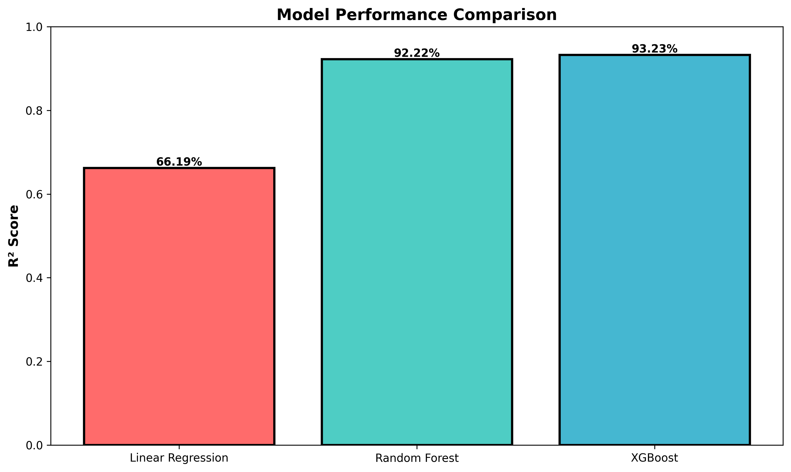
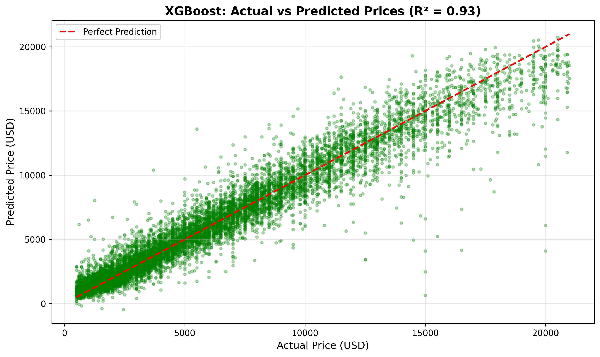
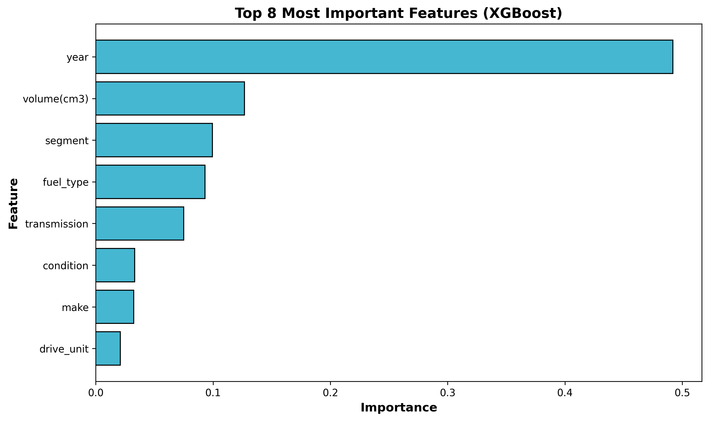
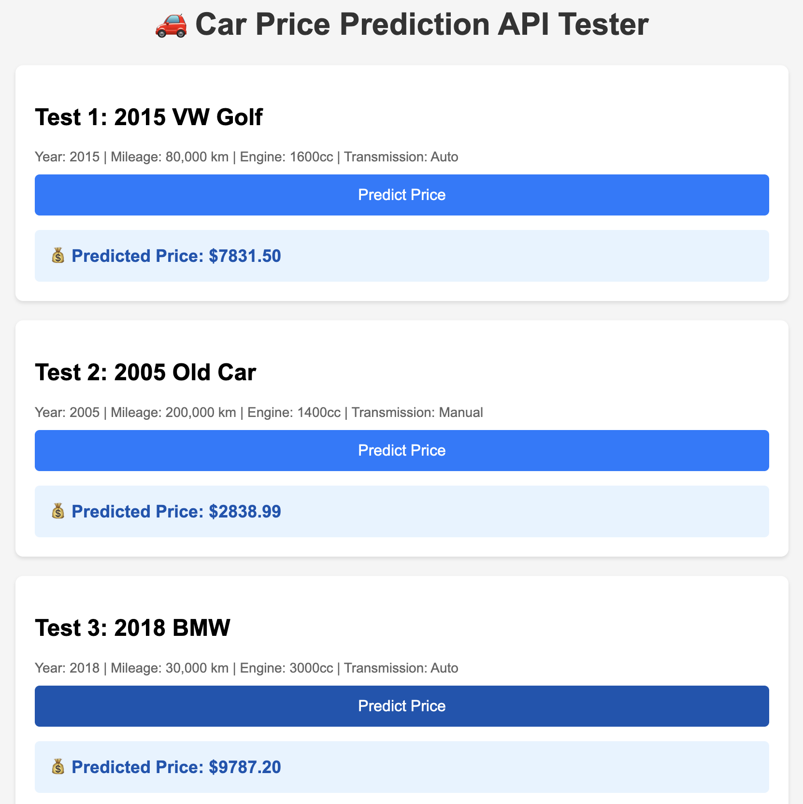

# 🚗 Car Price Prediction - Machine Learning Project


A complete machine learning project to predict used car prices for a local dealership using regression models. Achieved **93.2% accuracy** with XGBoost.

---

## 📊 Project Overview

### Business Problem
A local car dealership struggles with inconsistent pricing:
- **Underpricing** → Lost revenue
- **Overpricing** → Slow inventory turnover

### Solution
Built a machine learning model to predict car prices based on features like make, model, year, mileage, and more.

### Results
- ✅ **93.2% accuracy** (R² Score)
- ✅ Average prediction error: **$822**
- ✅ Trained on **52,253 cars**
- ✅ **REST API** ready for deployment

---

### Quick Demo

**Example Prediction:**
```json
Input:  2015 VW Golf, 80,000 km, 1600cc
Output: $7,831.50 (Confidence: 93.2%)
```

---

## 📸 Visualizations

### Model Performance Comparison


### XGBoost Predictions

*93.2% accuracy - predictions closely follow the perfect prediction line*

### Feature Importance

*Year dominates price prediction, followed by engine volume and segment*

---

## 📦 Model Files

### Available Models

| Model | R² Score | Size | Location |
|-------|----------|------|----------|
| Linear Regression | 66.2% | Small | `models/linear_regression_model.pkl` |
| **XGBoost** 🏆 | **93.2%** | Small | `models/xgboost_model.pkl` |
| Random Forest | 92.2% | 346 MB | [📥 Download from Google Drive](https://drive.google.com/file/d/12SgOM65rnbqwEVwGbqDl-gERr41Hkngj/view?usp=sharing) |

**Note:** Random Forest model is hosted on Google Drive due to GitHub's 100 MB file size limit.

### Using the Models
```python
import joblib

# Load XGBoost (recommended - best performance)
model = joblib.load('models/xgboost_model.pkl')

# Or download Random Forest from Google Drive and load it
# model = joblib.load('path/to/downloaded/random_forest_model.pkl')
```

---

## 🎯 Key Features

- **Data Cleaning**: Handled 56K+ rows, removed outliers, filled missing values
- **EDA**: Comprehensive exploratory analysis with 10+ visualizations
- **Multiple Models**: Compared Linear Regression, Random Forest, XGBoost
- **Feature Engineering**: Encoded categorical variables, analyzed feature importance
- **Production Ready**: Flask API for real-time predictions
- **Model Persistence**: Saved models for deployment

---

## 📈 Model Performance

| Model | MAE | RMSE | R² Score |
|-------|-----|------|----------|
| Linear Regression | $1,990 | $2,754 | 66.2% |
| Random Forest | $843 | $1,321 | 92.2% |
| **XGBoost** 🏆 | **$822** | **$1,232** | **93.2%** |

**Winner**: XGBoost with 93.2% accuracy!

---

## 🔍 Key Insights

### Feature Importance
1. **Year (49%)** - Most important factor!
2. **Engine Volume (13%)** - Bigger engines = higher prices
3. **Segment (10%)** - Car class matters
4. **Fuel Type (9%)** - Diesel vs Petrol
5. **Mileage (0.6%)** - Surprisingly low impact!

**Key Finding**: Year matters 80× more than mileage in determining price!

---

## 🛠️ Tech Stack

- **Language**: Python 3.11
- **Data Processing**: Pandas, NumPy
- **Visualization**: Matplotlib, Seaborn
- **ML Libraries**: scikit-learn, XGBoost
- **API**: Flask, Flask-CORS
- **Environment**: Jupyter Notebook, VSCode

---

## 📂 Project Structure
```
auto-regression-price-predictor/
├── data/
│   ├── raw/                    # Original dataset (56K cars)
│   └── processed/              # Cleaned dataset (52K cars)
├── models/                     # Trained models (.pkl files)
│   ├── linear_regression_model.pkl
│   ├── random_forest_model.pkl
│   └── xgboost_model.pkl      # Best model
├── notebooks/
│   └── car_price_analysis.ipynb  # Complete analysis
├── api.py                      # Flask API
├── test_api.py                 # API testing script
├── requirements.txt            # Dependencies
└── README.md                   # This file
```

---

## 🚀 Getting Started

### Prerequisites
- Python 3.8+
- pip

### Installation

1. **Clone the repository**
```bash
git clone https://github.com/yourusername/auto-regression-price-predictor.git
cd auto-regression-price-predictor
```

2. **Create virtual environment**
```bash
python3 -m venv venv
source venv/bin/activate  # On Windows: venv\Scripts\activate
```

3. **Install dependencies**
```bash
pip install -r requirements.txt
```

4. **Run Jupyter Notebook**
```bash
jupyter notebook
```
Open `notebooks/car_price_analysis.ipynb`

---

## 🌐 API Usage

### Start the API Server
```bash
python api.py
```

The API will run at `http://localhost:5000`

### Make a Prediction

**Request:**
```bash
curl -X POST http://localhost:5000/predict \
  -H "Content-Type: application/json" \
  -d '{
    "year": 2015,
    "mileage": 80000,
    "volume": 1600,
    "make": 82,
    "fuel_type": 1,
    "transmission": 0
  }'
```

**Response:**
```json
{
  "predicted_price": 7831.5,
  "currency": "USD",
  "model": "XGBoost",
  "confidence": "R² = 0.9323"
}
```

### API Endpoints

| Endpoint | Method | Description |
|----------|--------|-------------|
| `/` | GET | API information |
| `/health` | GET | Health check |
| `/predict` | POST | Predict car price |

---

## 🎨 Live Demo (HTML Interface)

Test the API directly in your browser!

**Run the demo:**
```bash
# Terminal 1: Start API
python api.py

# Terminal 2: Open HTML tester
open test_form.html
```

**Screenshot:**


The interface lets you test 3 different car scenarios:
1. **2015 VW Golf** → $7,831
2. **2005 Old Car** → $2,839 (low price due to age & mileage)
3. **2018 BMW** → $9,787 (high price due to recent year & luxury brand)

---

## 📊 Dataset

- **Source**: Car listings from 2019
- **Size**: 56,244 cars (original) → 52,253 (cleaned)
- **Features**: 11 (make, model, year, mileage, fuel type, etc.)
- **Target**: Price in USD ($500 - $20,994)

### Data Cleaning
- Removed 3,880 outliers (prices under $500 or over $20,994)
- Handled 4,782 missing values
- Removed 87 duplicate rows
- Retained 93% of original data

---

## 🧪 Model Training Process

1. **Data Loading & Exploration**
2. **Data Cleaning** (outliers, missing values, duplicates)
3. **Feature Engineering** (encoding categorical variables)
4. **Train/Test Split** (80/20)
5. **Model Training** (Linear, RF, XGBoost)
6. **Evaluation** (MAE, RMSE, R²)
7. **Model Selection** (XGBoost wins!)
8. **Model Persistence** (saved as .pkl)

---

## 📝 Future Improvements

- [ ] Add more advanced models (LightGBM, CatBoost)
- [ ] Implement hyperparameter tuning
- [ ] Create frontend UI (React/Streamlit)
- [ ] Deploy to cloud (AWS/Heroku/Railway)
- [ ] Add model monitoring and retraining pipeline
- [ ] Expand to international markets

---

## 🤝 Contributing

Contributions are welcome! Please feel free to submit a Pull Request.

---

## 📄 License

This project is licensed under the MIT License.

---

## 👤 Author

**akakinad**
- GitHub: [akakinad](https://github.com/yourusername)

---

## 🙏 Acknowledgments

- Dataset source: [Original source]
- Inspiration: Real-world dealership pricing challenges
- Built as part of machine learning portfolio

---

⭐ **Star this repo if you found it helpful!**